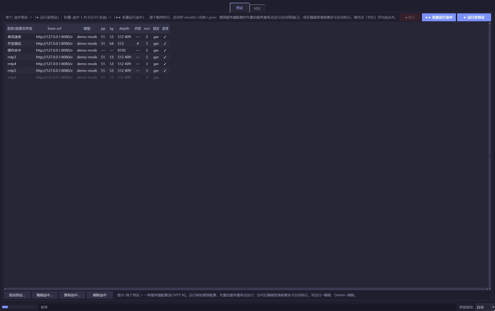
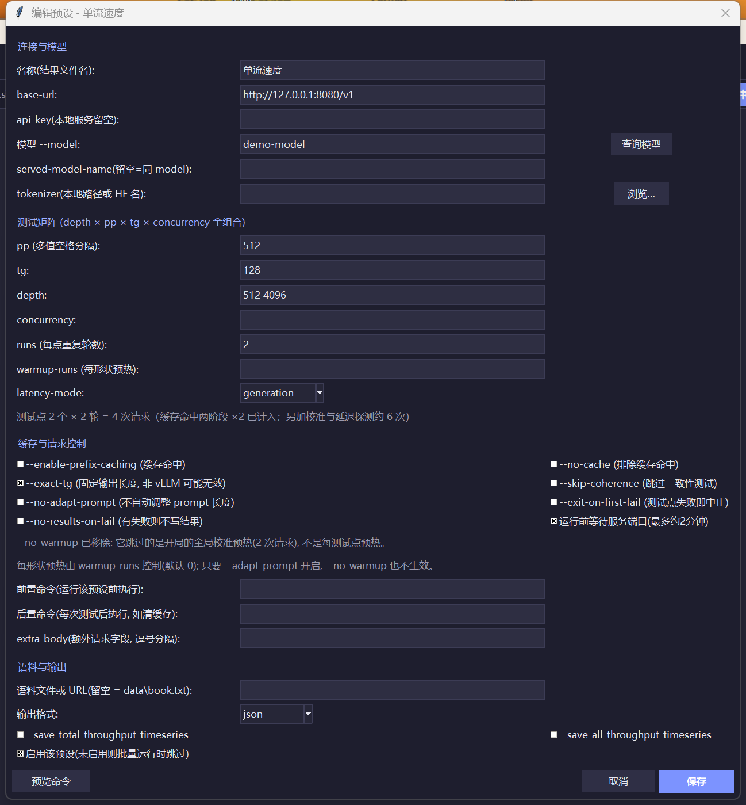
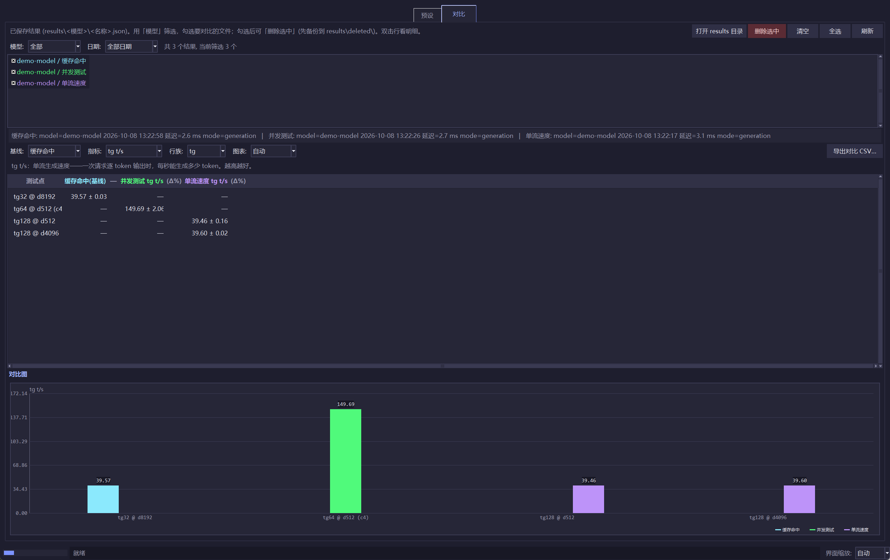

**EN** · [中文](README.md)

# llama-benchy — Offline Self-Contained Portable Edition

llama-bench style benchmarking tool for **any OpenAI-compatible endpoint**
(llama.cpp, vLLM, SGLang, ...), packaged as a **fully self-contained, no-install,
offline** bundle for Windows x64.



- **No install** — the portable bundle ships its own CPython 3.12 + all dependencies.
- **No network** — tokenizer, corpus and model-name validation are all local.
- **No system-drive writes** — everything the tool writes stays inside its own folder.
- Copy the folder anywhere, double-click `GUI.bat`, done.

Upstream project: [eugr/llama-benchy](https://github.com/eugr/llama-benchy).
This fork changes **only the offline/portable behaviour** — the test matrix, the
metrics and the CLI surface are identical to upstream `main`.

> Full Chinese parameter reference: [docs/params.zh.md](docs/params.zh.md)

---

## Why this tool

`llama-bench` (bundled with llama.cpp) only measures llama.cpp itself and calls the
C++ engine directly, so it does not reflect what a real API client sees. vLLM's own
benchmark tool measures TTFT as "first data chunk" rather than "first usable token",
and random prompts hit the prefix cache, which inflates prompt-processing numbers.

llama-benchy:

- measures **prompt processing (pp)** and **token generation (tg)** separately at each
  **context depth**;
- can measure pp **on top of an already cached context** (two-phase prefix-cache test);
- reports `ttfr`, `est_ppt` and end-to-end `ttft`;
- counts tokens with a real tokenizer, correctly handling multi-token blocks from
  MTP / speculative decoding;
- uses real book text as the prompt corpus (better for spec-decoding models than
  random tokens).

Currently only `/v1/chat/completions` is benchmarked.

---

## Quick start

### Option A — portable bundle (Windows x64, nothing to install)

1. Download the portable zip from [Releases](../../releases) and unpack it anywhere.
2. Start your inference server (e.g. llama.cpp on `127.0.0.1:8080`).
3. Double-click `GUI.bat` (recommended) or `run.bat`.

The bundle layout is:

```
llama-benchy-portable/
├── GUI.bat                 # tkinter control panel (recommended entry point)
├── run.bat                 # command-line run with default parameters
├── gui/                    # GUI source (tkinter, stdlib only)
├── python/                 # bundled CPython 3.12 + site-packages  (not in git)
├── llama_benchy/           # tool source
├── data/book.txt           # test corpus (replace with any long UTF-8 text)
├── .hf/  .tmp/  results/   # created at runtime, inside this folder only
```

### Option B — plain Python install

```bash
git clone https://github.com/<your-username>/llama-benchy-portable-win
cd llama-benchy-portable-win
pip install -r requirements.txt          # or: pip install .
python -m llama_benchy --base-url http://127.0.0.1:8080/v1 --model qwen \
  --runs 2 --pp 512 --tg 512 --depth 512 4096 8096 --latency-mode generation
```

`run.bat` and `GUI.bat` use the bundled interpreter if `python\python.exe` exists,
otherwise they fall back to the system `python`.

---

## GUI (recommended entry point)

Double-click `GUI.bat` — a tkinter panel with two tabs, no external dependencies.

### Presets tab

One preset = one server configuration (e.g. MTP3/4/5/6):

- built-in `mtp3`–`mtp6` templates; add / edit / copy presets;
- the editor dialog is split into four groups — **Connection & model**, **Test matrix**,
  **Cache & request control**, **Corpus & output** — with a **Preview command** button
  that prints the exact command line, and a live "N test points × M runs = K requests"
  estimate as the matrix changes;
- **Pre-command** — executed before that preset, typically to switch the server
  configuration (e.g. `restart_mtp3.bat` kills llama.cpp and restarts it with `--mtp 3`);
  leave it empty to test whatever is currently running;
- **Post-command** — maps to upstream `--post-run-cmd`, run after every test point
  (e.g. clearing the server cache);
- **Query model** reads `{base-url}/models`: auto-fills when there is a single model,
  otherwise opens a picker;
- the **Enabled** column (✓ / —): disabled presets are skipped in batch runs;
- run one preset, or select several (Ctrl multi-select / click the header for all) and
  they run sequentially;
- the tool waits up to ~2 min for the server port, then runs and saves
  `results\<model>\<preset name>.json` (name collisions get `_2`, `_3`, ...);
- the status bar reports **test points measured vs expected** — fewer means some points
  failed or were skipped;
- presets persist in `gui\batch.json`.



### Compare tab

Merge several saved JSON results into one table plus one chart:

- filter by **model** and **date** (date comes from the JSON `timestamp`, falling back to
  the file's modification time);
- checkbox multi-select; the checkbox text colour matches that series' colour in the chart;
  the baseline is selectable (defaults to the first selected file);
- shows `mean ± std` and **Δ%** (green up / red down), aligned by test shape
  (pp / tg / ctx_pp / ctx_tg);
- the **row family** filter offers `all / pp / tg / ctx_pp / ctx_tg`, default `tg`
  (generation only);
- hovering a header cell shows the full file name + date; double-clicking a row lists the
  raw mean±std for that test point across configurations;
- line chart when depth has multiple values, otherwise a grouped bar chart; legend and axis
  labels are laid out from measured pixel widths, so nothing gets clipped;
- "Delete selected" first copies the files to `results\deleted\` before deleting them —
  the backup directory is deliberately skipped by the scanner;
- export the merged table to CSV.



### Resolution / DPI handling

The window size is not hard-coded: the app turns on DPI awareness, sets `tk scaling` to the
real DPI, scales fonts and padding by the screen's logical resolution, and then derives the
window height from the measured fixed overhead. The status bar has an **interface scale**
dropdown (auto / small / standard / large) for multi-monitor or unusual scaling setups.

---

## CLI parameters

```
python -m llama_benchy --base-url URL [options]
```

Full Chinese parameter reference: [docs/params.zh.md](docs/params.zh.md)

### Connection & model

| Flag | Default | Description |
|---|---|---|
| `--base-url` | *(required)* | OpenAI-compatible endpoint, e.g. `http://127.0.0.1:8080/v1` |
| `--api-key` | `EMPTY` | API key |
| `--model` | auto-detect | Model name; auto-detected from `/models` if omitted. Non-HF names (e.g. `my-model`) are accepted as-is |
| `--served-model-name` | same as `--model` | Name actually used in API calls |
| `--tokenizer` | same as `--model` | HF name **or local path**. Offline fallback: bundled `assets/gpt2_tokenizer.json`. Pass a Qwen `tokenizer.json` for exact token counts |

### Test matrix

| Flag | Default | Description |
|---|---|---|
| `--pp` | `[2048]` | Prompt-processing token counts (list) |
| `--tg` | `[32]` | Generation token counts (list) |
| `--exact-tg` | off | Force exact output length (`min_tokens` + `ignore_eos`); vLLM-style fixed-OSL tests. llama.cpp does not support these fields |
| `--depth` | `[0]` | Context depth list (tokens already in context before the prompt) |
| `--runs` | `3` | Runs per test point; reported as mean ± std |
| `--warmup-runs` | `0` | Discarded warmup runs per shape (also the number of generation latency probes) |
| `--concurrency` | `[1]` | Concurrency levels (list) |

Shapes are combined as a Cartesian product in the order **depth → pp → tg → concurrency**.

### Warmup & latency

| Flag | Default | Description |
|---|---|---|
| `--latency-mode` | `api` | `api` (network only) / `generation` (network + server overhead, recommended) / `none` |
| `--no-warmup` | off | Skip warmup (not recommended) |
| `--skip-coherence` | off | Skip the post-warmup sanity check |
| `--adapt-prompt` / `--no-adapt-prompt` | on | Adjust prompt length so real prompt tokens match `--pp` |

### Cache & request control

| Flag | Default | Description |
|---|---|---|
| `--enable-prefix-caching` | off | Two-phase measurement: `ctx_pp`/`ctx_tg` (cold context load) then `pp`/`tg` (hot follow-up on the cached context). Requires `--depth > 0` |
| `--no-cache` | off | Add noise to avoid cache hits and send `cache-prompt=false` |
| `--post-run-cmd` | — | Command run after each test (e.g. clearing the server cache) |
| `--extra-body` | — | Extra JSON fields, `key=value` or `key:value`, comma-separated |

### Corpus & output

| Flag | Default | Description |
|---|---|---|
| `--book-url` | `data/book.txt` | Local file path (default, offline) or http(s) URL |
| `--save-result` | — | Output file path; nothing is written if omitted |
| `--format` | `md` | `md` / `json` / `csv` |
| `--save-total-throughput-timeseries` | off | Per-second total throughput series (JSON only) |
| `--save-all-throughput-timeseries` | off | Per-request throughput series (JSON only) |
| `--emit-progress PATH` | — | JSONL progress event stream to PATH or `-` (stdout) |

### Error handling

| Flag | Description |
|---|---|
| `--exit-on-first-fail` | Stop at the first failed test point |
| `--no-results-on-fail` | Print/save nothing; implies `--exit-on-first-fail` |

---

## Reading the results

All times are **milliseconds**, values are `mean ± std`.

| Column | Meaning |
|---|---|
| `t/s` (pp row) | Prompt processing speed = prompt tokens ÷ `est_ppt` |
| `t/s` (tg row) | Decode speed = tokens after the first ÷ (last token − first token) |
| `t/s (total)` / `t/s (req)` | Only when concurrency > 1: aggregate throughput / per-request average |
| `peak t/s` | tg rows only: best 1-second window during the run |
| `ttfr (ms)` | Time to first response chunk (may be an empty chunk); includes network latency |
| `est_ppt (ms)` | Estimated server-side prompt processing = `ttfr − measured latency` |
| `e2e_ttft (ms)` | Time to first **content** token — what the user actually feels |

**PP measurement note.** Upstream computes `est_ppt` from the first SSE chunk. Servers
that send an empty chunk before prefill finishes (some speculative-decoding servers)
then produce impossible numbers (100k+ t/s). This fork uses the first **real content
token** instead. For llama.cpp / vLLM the two timestamps coincide, so results are
unchanged; only the "early empty chunk" case is corrected. Already-saved JSON files are
not retroactively changed — re-run to get correct PP.

---

## Portability guarantees

1. **Offline** — three network paths are localized: model-name validation (non-HF names
   pass, HF validation failure is a warning), tokenizer (bundled `gpt2_tokenizer.json`),
   corpus (local `data/book.txt` first).
2. **No system-drive writes** — `HF_HOME` points to `.hf/`, cache/temp go to the folder,
   results go to `results/`. `%USERPROFILE%` is never touched.
3. **No proxy** — `run.bat` clears `HTTP(S)_PROXY` and sets a clean `NO_PROXY`. Some
   environments inject `NO_PROXY` containing `[::1]`, which crashes httpx
   (`InvalidURL: Invalid port ':1]'`).
4. **`.bat` files must stay pure ASCII** — cmd reads them with the system ANSI codepage
   (GBK on Chinese Windows); UTF-8 comments get mis-parsed as commands.

---

## Repo layout

```
llama-benchy-portable-win/
├── README.md / README.en.md            # Chinese is primary, this file is the translation
├── LICENSE
├── pyproject.toml / requirements.txt
├── GUI.bat / run.bat / bootstrap.bat   # ASCII-only launchers
├── llama_benchy/                       # tool source + assets/gpt2_tokenizer.json
├── gui/                                # tkinter GUI (bench_gui.py, ui_theme.py)
├── docs/params.zh.md                   # full Chinese parameter reference
├── docs/screenshots/                   # GUI screenshots
├── data/book.txt                       # offline corpus
└── tools/                              # wait_port.py / mock_server.py / gui_screenshot.py / make_portable_zip.ps1
```

Runtime artifacts (`results/`, `.hf/`, `.tmp/`, `data/cache/`, `gui/runs/`,
`gui/batch.json`, `gui/gui.log`) and the bundled `python/` runtime are git-ignored;
the portable bundle is distributed as a Release asset.

---

## Differences from upstream

| Item | Upstream | This edition |
|---|---|---|
| Python runtime | uv / venv | Bundled CPython 3.12 in the portable zip |
| Book corpus | Downloads from Project Gutenberg | Local `data/book.txt` by default |
| Tokenizer | Downloads from HF | Bundled gpt2 fallback; local path supported |
| Writes | System cache dirs | Only inside the bundle folder |
| PP measurement | First SSE chunk | First real content token (fixes inflated PP) |
| Warmup | 1 run per shape | 0 by default (`--warmup-runs 1` restores old behaviour) |
| Result saving | one manually named file | `results\<model>\<preset name>.json`, collisions get `_2`, `_3` |
| GUI | none | tkinter presets / compare panel (labels in Chinese) |
| Resolution handling | fixed window | DPI awareness + scaling by the screen's logical resolution |
| CLI | `main` | Identical |

---

## License

MIT — see [LICENSE](LICENSE). Core tool copyright belongs to the upstream
[llama-benchy](https://github.com/eugr/llama-benchy) author; the offline/portable
changes are the only addition here.
